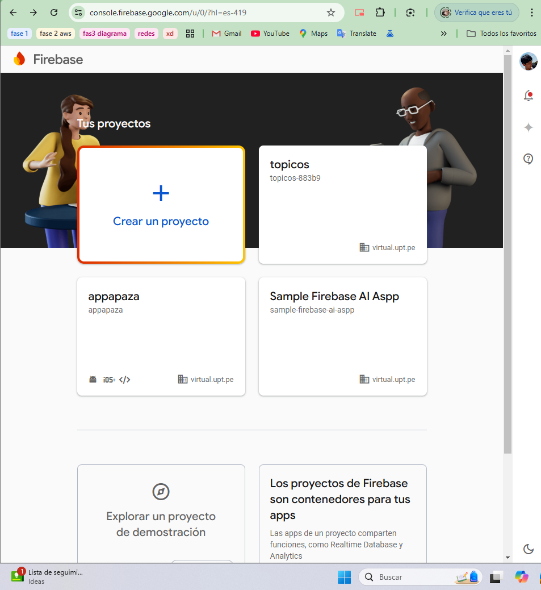
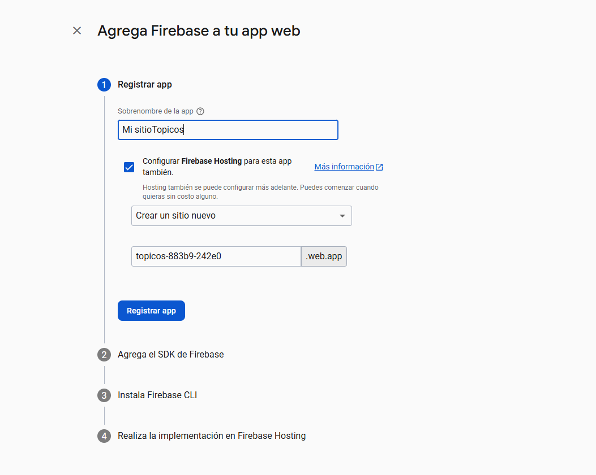
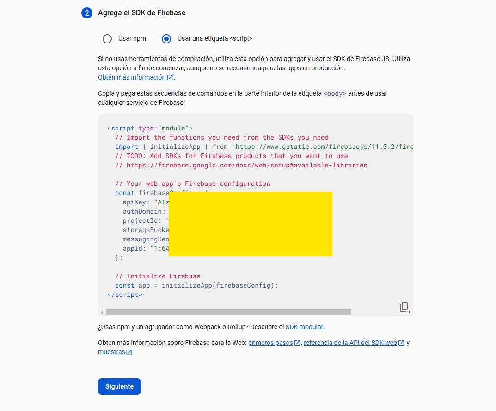
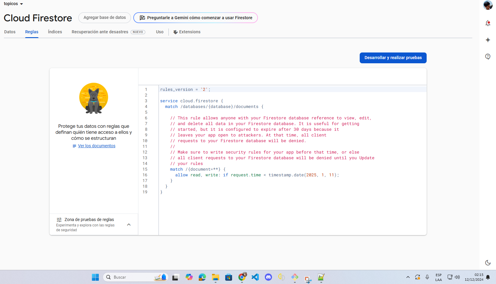
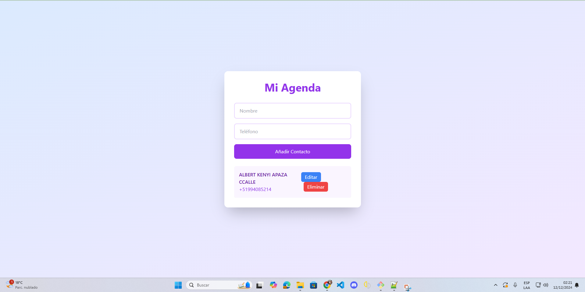

# Agenda con Firebase

Una aplicación web que utiliza Firebase Firestore para gestionar una agenda de contactos con operaciones CRUD (Crear, Leer, Actualizar, Eliminar).

## Descripción

Esta aplicación permite a los usuarios añadir, visualizar, editar y eliminar contactos de una lista en tiempo real, usando Firebase Firestore como base de datos NoSQL en la nube.

## Características

- **Crear**: Añadir nuevos contactos a la agenda.
- **Leer**: Mostrar todos los contactos almacenados.
- **Actualizar**: Modificar la información de un contacto existente.
- **Eliminar**: Borrar contactos de la lista.

## Configuración

### 1. Creación del Proyecto en Firebase
- **Imagen**: 
  
  - Crea un nuevo proyecto en la consola de Firebase.

### 2. Agregar Firebase a tu Página Web
- **Imagen**: 
  
  - Registra tu aplicación web para obtener las credenciales necesarias.

### 3. Obtener el SDK de Firestore
- **Imagen**: 
  
  - Incluir los scripts necesarios para Firestore en tu proyecto.

### 4. Configurar Cloud Firestore
- **Reglas de Seguridad**: 
  - Asegúrate de configurar las reglas de seguridad. Para este proyecto de desarrollo, las reglas están establecidas con una fecha de expiración hasta el 11 de enero de 2025.
- **Imagen**: 
  

### 5. Código del Aplicativo
- **Imagen**: 
  
  - El código HTML, CSS y JavaScript está incluido en el archivo `index.html` de este repositorio.

### Uso

- **Ejecutar**: Abre `index.html` en tu navegador web para ejecutar la aplicación. Asegúrate de que tu configuración de Firebase en el código sea correcta y coincida con la de tu proyecto en Firebase.

- **CRUD Operations**:
  - Añade un nuevo contacto usando los campos de entrada y el botón "Añadir Contacto".
  - Edita un contacto existente haciendo clic en "Editar" y actualizando la información en los diálogos emergentes.
  - Borra un contacto con el botón "Eliminar" después de confirmar la acción.

## Notas Importantes

- **Seguridad**: Las reglas de seguridad actuales permiten acceso sin autenticación hasta la fecha límite especificada. Para un entorno de producción, deberías ajustar estas reglas para mejorar la seguridad.

- **Almacenamiento de Credenciales**: Las credenciales de Firebase están presentes en el código por simplicidad. En un entorno de producción, considera usar Firebase Hosting o un backend para gestionar credenciales de manera segura.

- **Desarrollo Continuo**: Este proyecto está diseñado para ser un punto de partida. Se sugiere mejorar la interfaz de usuario, manejo de errores, y añadir características como autenticación de usuarios.
